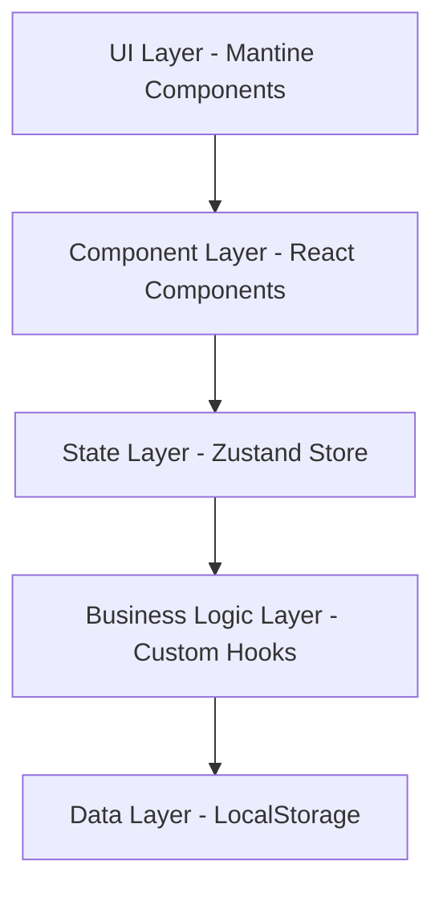

# 🚀 Windsurf Todo Demo

> **30분 라이브 코딩 데모**를 위한 모던 Todo 관리 웹 애플리케이션

## 📋 프로젝트 개요

Windsurf Todo Demo는 베테랑 개발자들을 대상으로 한 30분 라이브 코딩 세션에서 **바이브 코딩(Vibe Coding)**의 효율성과 생산성을 보여주기 위해 설계된 Todo 관리 애플리케이션입니다.

### 🎯 데모 목표

- **빠른 프로토타이핑**: 아이디어에서 동작하는 앱까지 30분 내 완성
- **모던 기술 스택**: React 18 + TypeScript + Vite + Mantine UI 활용
- **클린 아키텍처**: 확장 가능하고 유지보수가 용이한 구조 설계
- **실시간 개발**: TDD와 Clean Code 원칙을 적용한 라이브 코딩

## 🛠️ 기술 스택

### Frontend
- **React 18** - 컴포넌트 기반 UI 라이브러리
- **TypeScript** - 타입 안전성과 개발자 경험 향상
- **Vite** - 빠른 개발 서버와 빌드 도구
- **Mantine UI** - 모던하고 접근성 높은 컴포넌트 라이브러리

### 상태 관리
- **Zustand** - 경량화된 상태 관리 라이브러리

### 데이터 저장
- **LocalStorage** - 클라이언트 사이드 데이터 영속성

### 개발 도구
- **ESLint** - 코드 품질 관리
- **Prettier** - 코드 포맷팅
- **Vitest** - 단위 테스트 프레임워크

## 🏗️ 아키텍처

### 시스템 아키텍처 (5-Layer)



### 컴포넌트 구조

```
src/
├── components/           # React 컴포넌트
│   ├── Header.tsx       # 헤더 및 통계 표시
│   ├── TodoInput.tsx    # Todo 입력 폼
│   ├── TodoList.tsx     # Todo 목록 컨테이너
│   └── TodoItem.tsx     # 개별 Todo 아이템
├── stores/              # Zustand 상태 관리
│   └── todoStore.ts     # Todo 상태 및 액션
├── types/               # TypeScript 타입 정의
│   └── todo.ts          # Todo 관련 타입
├── utils/               # 유틸리티 함수
│   └── storage.ts       # LocalStorage 헬퍼
├── App.tsx              # 메인 애플리케이션
└── main.tsx             # 애플리케이션 진입점
```

## 🎨 UI/UX 디자인

### 디자인 시스템

#### 색상 팔레트
- **Primary**: `#FF6B35` (Orange Red)
- **Primary Variant**: `#FF8C42` (Orange)
- **Background**: `#F8F9FA` (Light Gray)
- **Surface**: `#FFFFFF` (White)
- **Success**: `#28A745` (Green)
- **Error**: `#DC3545` (Red)

#### 주요 특징
- 🎨 **모던 디자인**: 그라디언트와 카드 기반 레이아웃
- 📱 **반응형**: 모바일 우선 설계
- ♿ **접근성**: WCAG 2.1 AA 준수
- 🎯 **직관적 UX**: 학습 곡선 없는 인터페이스

## 🚀 시작하기

### 전제 조건

- Node.js 18+ 
- npm 또는 yarn

### 설치 및 실행

```bash
# 저장소 클론
git clone <repository-url>
cd windsurf-todo-demo

# 의존성 설치
npm install

# 개발 서버 실행
npm run dev

# 브라우저에서 http://localhost:5173 접속
```

### 빌드

```bash
# 프로덕션 빌드
npm run build

# 빌드 결과 미리보기
npm run preview
```

## 🧪 테스트

```bash
# 단위 테스트 실행
npm run test

# 테스트 커버리지 확인
npm run test:coverage

# 테스트 감시 모드
npm run test:watch
```

## 📚 핵심 기능

### ✅ Todo 관리
- **추가**: 새로운 할일 생성
- **조회**: 전체/완료/미완료 필터링
- **수정**: 할일 내용 편집
- **삭제**: 불필요한 할일 제거
- **완료 처리**: 체크박스로 상태 토글

### 📊 통계 대시보드
- 전체 할일 개수
- 완료된 할일 개수
- 대기 중인 할일 개수
- 완료율 시각화

### 💾 데이터 영속성
- LocalStorage 자동 저장
- 페이지 새로고침 시 데이터 유지
- 브라우저 간 데이터 격리

## 🎬 라이브 코딩 데모 시나리오

### Phase 1: 프로젝트 설정 (5분)
1. Vite + React + TypeScript 프로젝트 생성
2. Mantine UI 및 Zustand 설치
3. 기본 프로젝트 구조 설정

### Phase 2: 핵심 구현 (20분)
1. **Todo 타입 및 스토어 정의** (3분)
2. **Header 컴포넌트 구현** (4분)
3. **TodoInput 컴포넌트 구현** (4분)
4. **TodoList 및 TodoItem 구현** (6분)
5. **LocalStorage 연동** (3분)

### Phase 3: 완성 및 데모 (5분)
1. 스타일링 최종 조정
2. 기능 테스트 및 버그 수정
3. 라이브 데모 시연

## 📖 문서

- [📋 PRD (Product Requirements Document)](./docs/prd-todo-app.md)
- [🔧 코드 품질 규칙](./docs/globalrule.md)
- [🎨 UI 목업](./ui-mockup.html)

## 🤝 기여하기

1. Fork the Project
2. Create your Feature Branch (`git checkout -b feature/AmazingFeature`)
3. Commit your Changes (`git commit -m 'Add some AmazingFeature'`)
4. Push to the Branch (`git push origin feature/AmazingFeature`)
5. Open a Pull Request

## 📄 라이선스

이 프로젝트는 MIT 라이선스 하에 배포됩니다. 자세한 내용은 `LICENSE` 파일을 참조하세요.

## 👥 팀

- **개발자**: Windsurf AI Assistant
- **프로젝트 관리**: 바이브 코딩 데모팀
- **디자인**: Mantine UI 기반 커스텀 디자인

## 🙏 감사의 말

- [Mantine](https://mantine.dev/) - 훌륭한 React 컴포넌트 라이브러리
- [Zustand](https://github.com/pmndrs/zustand) - 간단하고 강력한 상태 관리
- [Vite](https://vitejs.dev/) - 빠르고 현대적인 빌드 도구
- [React](https://reactjs.org/) - 컴포넌트 기반 UI 라이브러리

---

**🚀 30분 만에 완성하는 모던 웹 애플리케이션 개발의 새로운 패러다임을 경험해보세요!**
