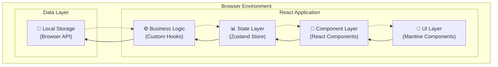
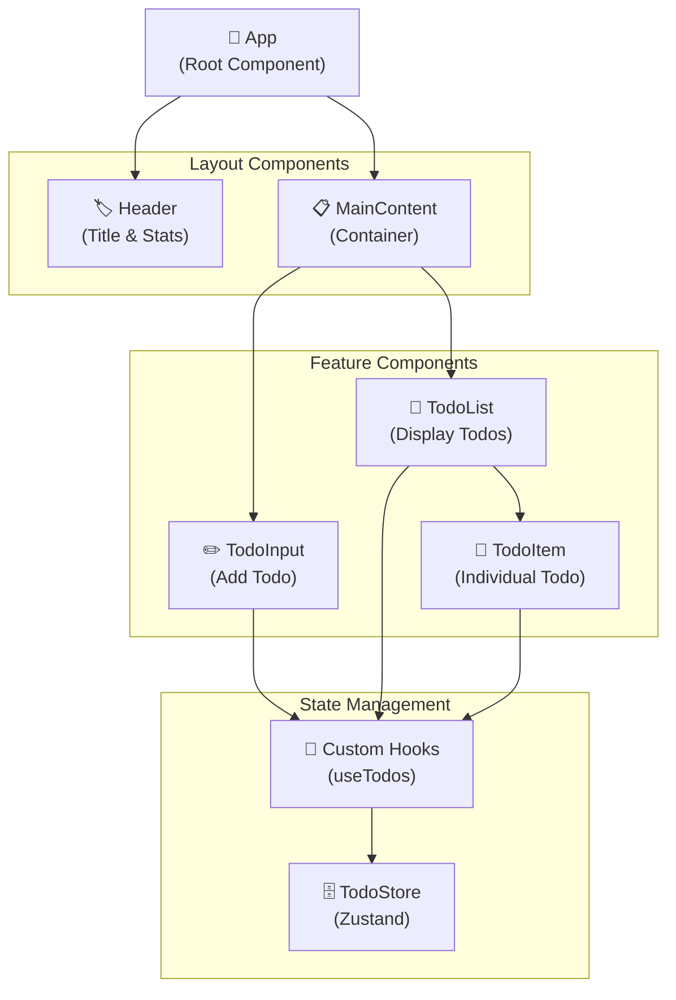
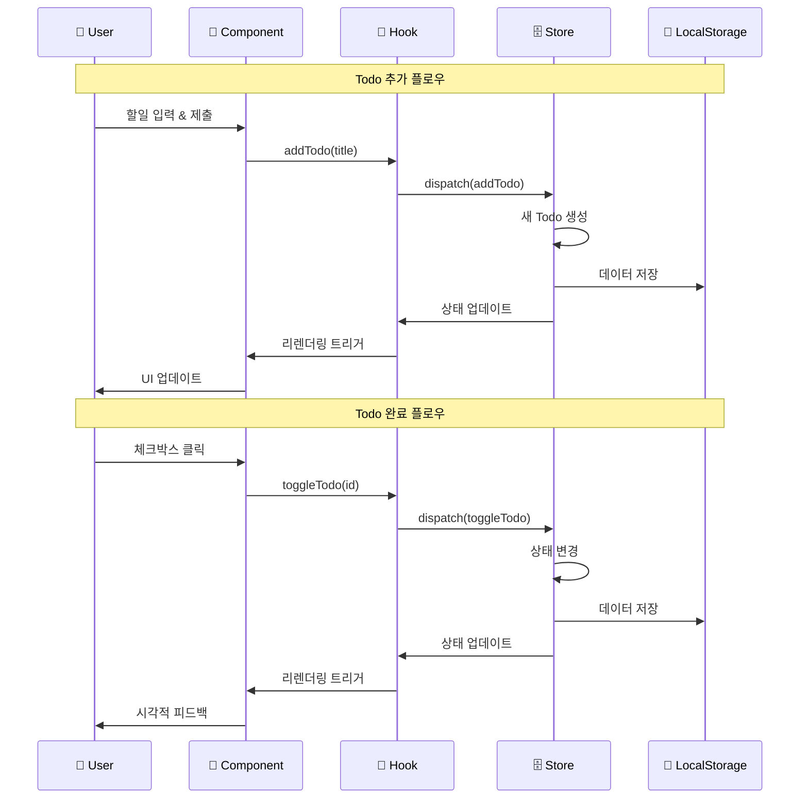

# PRD: Todo 관리 웹 앱 라이브 코딩 데모

## 📋 제품 개요

### 제품명
**Windsurf Todo Demo** - 바이브 코딩 시연용 Todo 관리 웹 애플리케이션

### 제품 목적
베테랑 개발자 대상으로 Windsurf Cascade를 활용한 소프트웨어 개발 전반의 흐름을 30분 내에 시연하는 MVP 수준의 Todo 앱

---

## 🎯 제품 비전 & 목표

### 비전
"AI 기반 개발 도구의 효율성과 개발 생산성 향상을 실제 코딩을 통해 증명"

### 핵심 목표
1. **개발 속도**: 30분 내 완전 동작하는 웹 앱 구현
2. **코드 품질**: Clean Architecture 및 SOLID 원칙 적용
3. **사용자 경험**: 직관적이고 반응형 UI 제공
4. **기술 시연**: 현대적 기술 스택의 효과적 활용

---

## 👥 타겟 사용자

### 주요 사용자
- **베테랑 개발자**: 새로운 개발 도구에 관심이 있는 경험 많은 개발자
- **기술 리더**: 팀의 개발 생산성 향상 방안을 모색하는 리더
- **얼리 어답터**: 최신 AI 개발 도구를 적극 도입하려는 개발자

### 사용자 니즈
- 빠른 프로토타이핑 도구
- 코드 품질을 유지하면서도 개발 속도 향상
- 현대적 기술 스택의 효율적 활용

---

## 🚀 핵심 기능

### 1. 할일 관리 (Core Features)
#### 1.1 할일 추가
- **입력 필드**: 제목 (필수)
- **자동 생성**: 생성일, 수정일, 고유 ID
- **기본 상태**: 미완료 (pending)

#### 1.2 할일 조회
- **표시 형태**: 목록 형태 (List View)
- **표시 정보**: 제목, 상태, 생성일
- **정렬**: 생성일 기준 (최신순)

#### 1.3 할일 수정
- **편집 방식**: 인라인 편집 (In-place editing)
- **수정 가능 필드**: 제목
- **자동 업데이트**: 수정일 갱신

#### 1.4 할일 삭제
- **삭제 방식**: 즉시 삭제 (No confirmation)
- **UI**: 삭제 버튼 클릭

#### 1.5 완료 처리
- **UI 요소**: 체크박스
- **시각적 피드백**: 완료 시 삭제선 표시
- **상태 변경**: pending ↔ completed

### 2. 데이터 관리
#### 2.1 데이터 구조
```typescript
interface Todo {
  id: string;
  title: string;
  status: 'pending' | 'completed';
  createdAt: Date;
  updatedAt: Date;
}
```

#### 2.2 데이터 저장
- **저장소**: 브라우저 로컬 스토리지
- **형태**: JSON 형태로 직렬화
- **지속성**: 브라우저 세션 간 유지

---

## 🛠 기술 스택

### 프론트엔드
- **프레임워크**: React 18+
- **빌드 도구**: Vite
- **언어**: TypeScript
- **상태 관리**: Zustand
- **UI 라이브러리**: Mantine UI
- **스타일링**: CSS-in-JS (Mantine 내장)

### 개발 환경
- **패키지 매니저**: npm/yarn
- **개발 서버**: Vite Dev Server
- **타입 체킹**: TypeScript
- **코드 포맷팅**: Prettier (선택적)

### 참고 기술 스택
- [Agentic Coding 권장 스택](https://lucumr.pocoo.org/2025/6/12/agentic-coding/) 기반

---

## 🏗 아키텍처 설계

### 시스템 아키텍처



### 컴포넌트 아키텍처



### 데이터 플로우



### 레이어별 책임

#### 1. UI Layer (Presentation)
- **책임**: 사용자 인터페이스 렌더링
- **기술**: Mantine UI 컴포넌트
- **특징**: 순수 표현 계층, 비즈니스 로직 없음

#### 2. Component Layer (View)
- **책임**: React 컴포넌트 구조 및 이벤트 처리
- **기술**: React Functional Components + Hooks
- **특징**: 상태 관리는 Custom Hook에 위임

#### 3. State Layer (State Management)
- **책임**: 전역 상태 관리 및 상태 변경
- **기술**: Zustand Store
- **특징**: 불변성 보장, 타입 안전성

#### 4. Business Logic Layer
- **책임**: 비즈니스 규칙 및 데이터 변환
- **기술**: Custom Hooks + TypeScript
- **특징**: 재사용 가능한 로직 캡슐화

#### 5. Data Layer (Persistence)
- **책임**: 데이터 영속성 및 저장소 관리
- **기술**: Browser LocalStorage API
- **특징**: JSON 직렬화, 에러 처리

### 아키텍처 원칙

1. **관심사 분리 (Separation of Concerns)**
   - 각 레이어는 명확한 책임을 가짐
   - 레이어 간 의존성 최소화

2. **단방향 데이터 플로우 (Unidirectional Data Flow)**
   - 데이터는 상위에서 하위로 흐름
   - 이벤트는 하위에서 상위로 전파

3. **타입 안전성 (Type Safety)**
   - TypeScript를 통한 컴파일 타임 타입 검증
   - 인터페이스 기반 계약 정의

4. **테스트 가능성 (Testability)**
   - 각 레이어별 독립적 테스트 가능
   - 의존성 주입을 통한 모킹 지원

---

## 🎨 UI/UX 디자인

### 디자인 원칙
- **미니멀리즘**: 불필요한 요소 제거
- **모던함**: 현대적이고 깔끔한 인터페이스
- **직관성**: 학습 곡선 없는 사용법

### 색상 테마
- **주색상**: 오렌지 계열 (#FF6B35, #FF8C42)
- **보조색상**: 회색 계열 (#F8F9FA, #E9ECEF)
- **텍스트**: 다크 그레이 (#212529)

### 레이아웃
- **구조**: 단일 페이지 애플리케이션 (SPA)
- **반응형**: 모바일 우선 설계
- **컴포넌트**: Header, TodoInput, TodoList, TodoItem

### UI 컴포넌트 구조
```
┌─────────────────────────────────┐
│           Header                │
├─────────────────────────────────┤
│         Todo Input              │
├─────────────────────────────────┤
│  ☐ Todo Item 1        [Delete] │
│  ☑ Todo Item 2        [Delete] │
│  ☐ Todo Item 3        [Delete] │
└─────────────────────────────────┘
```

### UI 목업 디자인

#### 데스크톱 버전
> 📸 **스크린샷 첨부 예정**: 실제 구현 완료 후 데스크톱 버전 스크린샷을 여기에 첨부합니다.

**주요 특징:**
- 그라디언트 오렌지 헤더로 브랜드 아이덴티티 강화
- 통계 정보를 헤더에 표시하여 직관적 상태 파악
- 카드 형태의 Todo 아이템으로 모던한 느낌
- 호버 효과와 그림자로 인터랙션 피드백
- 완료된 항목은 시각적 차별화 (색상 변경 + 취소선)

#### 모바일 버전
> 📸 **스크린샷 첨부 예정**: 실제 구현 완료 후 모바일 버전 스크린샷을 여기에 첨부합니다.

**반응형 디자인 특징:**
- 모바일 화면에 최적화된 레이아웃
- 입력 필드와 버튼이 세로 배치로 변경
- 터치 친화적인 버튼 크기와 간격
- 전체 화면 활용으로 콘텐츠 가독성 향상

### 디자인 시스템

#### 색상 팔레트
- **Primary**: `#FF6B35` (Orange Red)
- **Primary Variant**: `#FF8C42` (Orange)
- **Background**: `#F8F9FA` (Light Gray)
- **Surface**: `#FFFFFF` (White)
- **Success**: `#28A745` (Green)
- **Error**: `#DC3545` (Red)
- **Text Primary**: `#212529` (Dark Gray)
- **Text Secondary**: `#6C757D` (Medium Gray)

#### 타이포그래피
- **Font Family**: Inter, -apple-system, BlinkMacSystemFont, 'Segoe UI'
- **Heading**: 28px/700 (Header Title)
- **Body**: 16px/400 (Todo Text, Input)
- **Caption**: 12px/400 (Meta Info, Stats)

#### 스페이싱
- **Container Max Width**: 600px
- **Padding**: 24px (Desktop), 16px (Mobile)
- **Border Radius**: 16px (Container), 12px (Components)
- **Gap**: 12px (List Items), 24px (Sections)

---

## 📁 프로젝트 구조

```
todo-app/
├── docs/
│   ├── pre-prd-todo-app.md
│   └── prd-todo-app.md
├── src/
│   ├── components/
│   │   ├── Header.tsx
│   │   ├── TodoInput.tsx
│   │   ├── TodoList.tsx
│   │   └── TodoItem.tsx
│   ├── stores/
│   │   └── todoStore.ts
│   ├── types/
│   │   └── todo.ts
│   ├── utils/
│   │   └── storage.ts
│   ├── App.tsx
│   └── main.tsx
├── public/
├── package.json
├── vite.config.ts
├── tsconfig.json
└── README.md
```

---

## 🔄 사용자 플로우

### 기본 플로우
1. **앱 접속** → 기존 할일 목록 로드
2. **할일 추가** → 입력 필드에 제목 입력 → Enter 또는 추가 버튼
3. **할일 완료** → 체크박스 클릭 → 시각적 피드백
4. **할일 수정** → 제목 클릭 → 인라인 편집 → Enter로 저장
5. **할일 삭제** → 삭제 버튼 클릭 → 즉시 삭제

### 데이터 플로우
```
User Action → Component → Zustand Store → Local Storage
                ↓
            UI Update ← State Change ← Data Persistence
```

---

## 📋 개발 요구사항

### 기능 요구사항
- [ ] Todo CRUD 기능 완전 구현
- [ ] 로컬 스토리지 데이터 지속성
- [ ] 반응형 UI 구현
- [ ] TypeScript 타입 안전성
- [ ] Clean Architecture 적용

### 비기능 요구사항
- [ ] 30분 내 완성 가능한 범위
- [ ] 즉시 실행 가능한 코드
- [ ] 브라우저 호환성 (모던 브라우저)
- [ ] 모바일 반응형 지원

### 제외 사항
- 검색/필터링 기능
- 카테고리/태그 시스템
- 사용자 인증
- 서버 사이드 기능
- 복잡한 애니메이션
- 접근성 최적화
- 에러 처리 (기본 수준만)

---

## 🚀 개발 계획

### Phase 1: 프로젝트 설정 (5분)
- [ ] Vite + React + TypeScript 프로젝트 생성
- [ ] Mantine UI, Zustand 의존성 설치
- [ ] 기본 프로젝트 구조 설정

### Phase 2: 핵심 기능 구현 (20분)
- [ ] Todo 타입 정의
- [ ] Zustand 스토어 구현
- [ ] 로컬 스토리지 유틸리티
- [ ] 기본 컴포넌트 구현 (Header, TodoInput, TodoList, TodoItem)
- [ ] CRUD 기능 연결

### Phase 3: UI 완성 및 테스트 (5분)
- [ ] Mantine UI 스타일링 적용
- [ ] 반응형 레이아웃 조정
- [ ] 기본 기능 테스트
- [ ] 데모 준비

---

## ✅ 완료 기준

### 최소 완료 기준 (MVP)
- [ ] 할일 추가/조회/수정/삭제 기능 동작
- [ ] 완료 상태 토글 기능
- [ ] 로컬 스토리지 데이터 지속성
- [ ] 기본적인 반응형 UI

### 이상적 완료 기준
- [ ] 깔끔하고 현대적인 UI
- [ ] 부드러운 사용자 경험
- [ ] 타입 안전성 보장
- [ ] 코드 구조의 확장성

---

## 📊 성공 지표

### 데모 성공 기준
1. **기능 완성도**: 모든 CRUD 기능이 정상 동작
2. **개발 속도**: 30분 내 완성
3. **코드 품질**: Clean Architecture 원칙 준수
4. **사용자 경험**: 직관적이고 반응성 있는 UI

### 청중 만족도
- Windsurf Cascade의 개발 효율성 체감
- 현대적 기술 스택의 활용도 이해
- AI 도구의 실용성 인식 개선

---

## 📝 추가 고려사항

### 데모 시 주의사항
- 네트워크 연결 불필요 (오프라인 동작)
- 브라우저 개발자 도구 활용 시연
- 실시간 코딩 과정의 자연스러운 설명

### 향후 확장 가능성
- 서버 사이드 연동
- 사용자 인증 시스템
- 협업 기능
- 고급 필터링/검색
- PWA 변환

---

*이 PRD는 30분 라이브 코딩 데모를 위한 최적화된 요구사항 문서입니다. 실제 프로덕션 환경에서는 추가적인 기능과 비기능 요구사항이 필요할 수 있습니다.*
